# 📚 iLibrary – Digital Library Management System

iLibrary is a **web-based Digital Library Management System** designed to simplify and digitize the process of managing books in a college library.  
Built as part of my **BCA Final Year Project (2022)**, the system allows students to check book availability online and librarians to manage issuing/returning books easily.

---

## 🚀 Features

### 👨‍🎓 Student Portal
- Register and login using roll number.
- Search books by **title, category, or serial number**.
- View Profile, issued books, due dates, and fines and logout functionality.

### 👩‍💼 Admin Portal
- Manage student registrations (approve/reject).
- Add new books with categories & cover images.
- Issue and return books with automatic fine calculation.
- View student profiles and manage accounts.

---

## 🛠️ Tech Stack

- **Frontend**: HTML, CSS, JavaScript  
- **Backend**: PHP (server-side scripting)  
- **Database**: MySQL  
- **Server**: Apache (via XAMPP)  

---

## 📂 Project Structure

```
ilibrary/
│── _Login/           # Login & Registration page
│── Admin/            # Admin portal (Add, Issue, Return, Registrations, Students, Settings)
│── Student/          # Student portal (Home, Profile, Navbar)
│── Shared/           # Shared pages (Book list, Profile)
│── xtra/             # resources
```

---

## ⚙️ Installation & Setup

1. Install **XAMPP** (v3.3.0 or above).  
2. Copy the `ilibrary` folder into the `htdocs` directory of XAMPP.  
3. Start **Apache** and **MySQL** from XAMPP Control Panel.  
4. Import the `ilibrary.sql` file into **phpMyAdmin** to create the database.  
5. Open a browser and go to:  
   ```
   http://localhost/ilibrary/_Login/Home.php
   ```
6. Register as a student, wait for admin approval, then log in.  

---

## 🖼️ Screenshots

### 🔑 Login Page
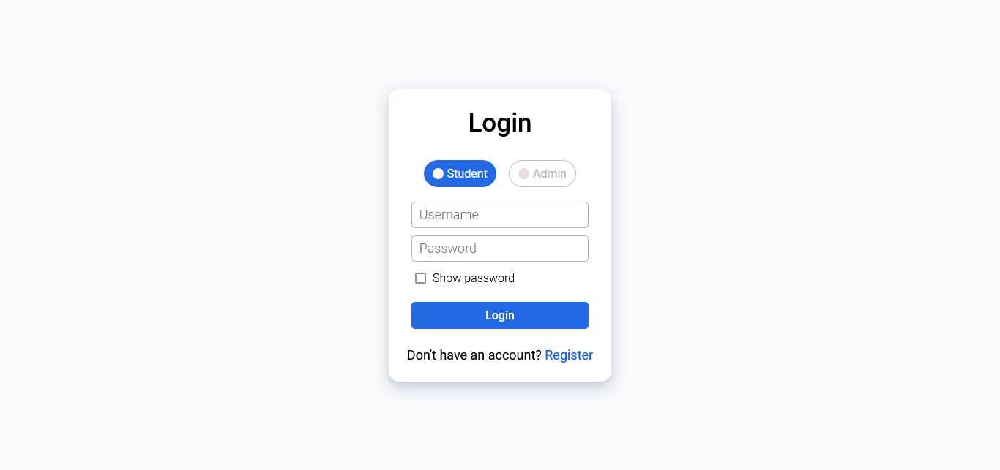

### 📝 Registration Page
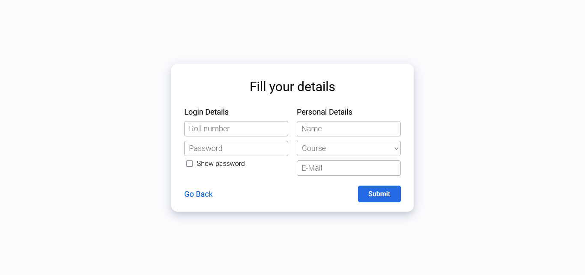

### 🏠 Home Page
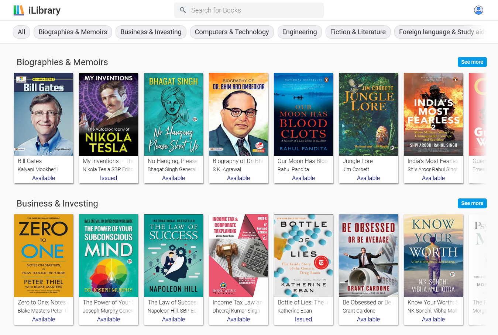

### 👤 Student Profile Page
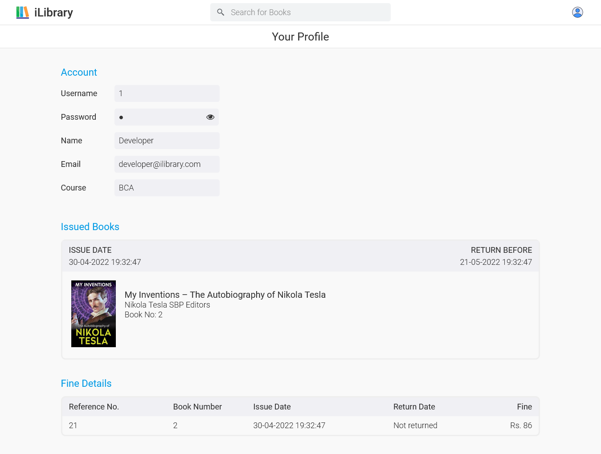

### ⚙️ Admin -  View Student Registrations
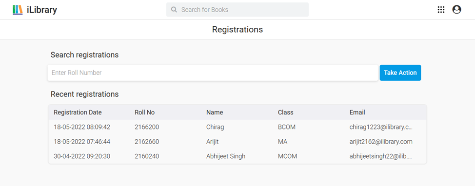

### ⚙️ Admin -  Manage Student Registration
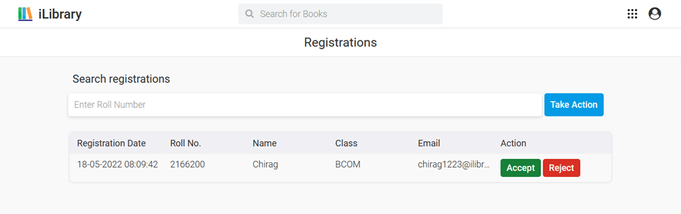

### ⚙️ Admin - Add Books
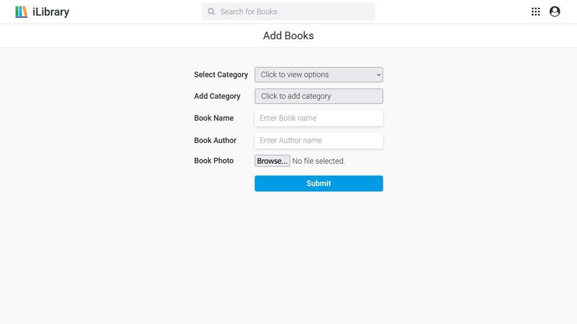

### ⚙️ Admin - View Issued Books
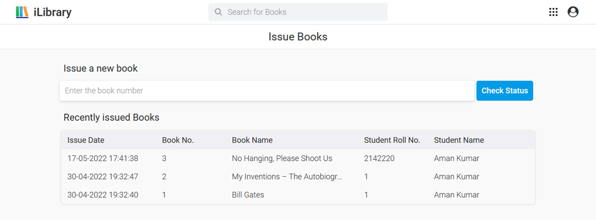

### ⚙️ Admin - Issue books
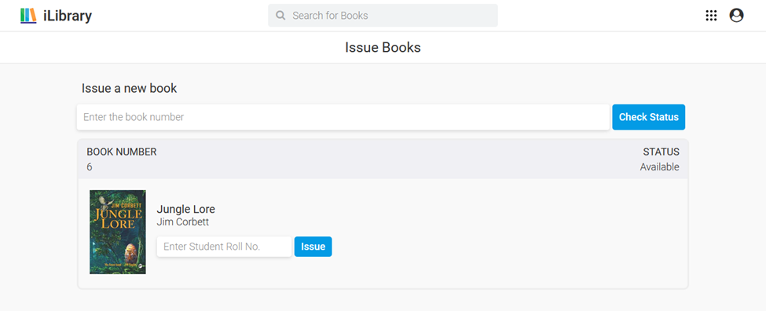

### ⚙️ Admin - View Returned Books
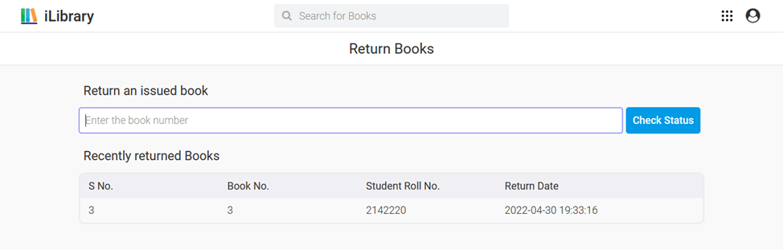

### ⚙️ Admin - Return books
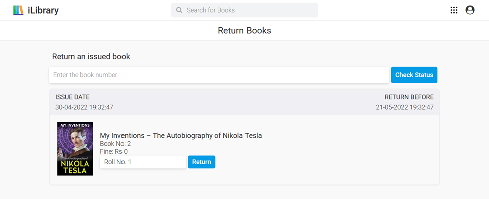

### ⚙️ Admin - Account Settings
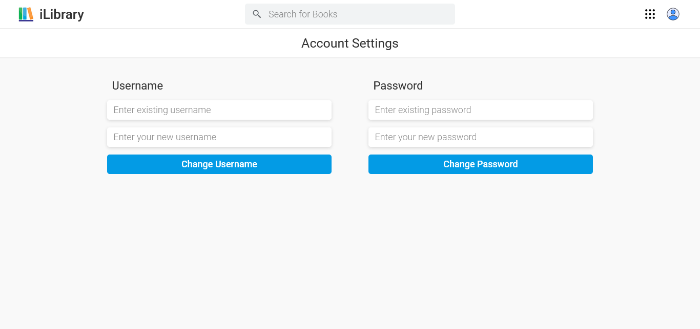


---

## 🗄️ Database Design

- **Tables**: `admin`, `book`, `student`, `registrations`, `issue`, `return`, `fine`  
- Relational schema ensures proper tracking of issued/returned books and fines.
   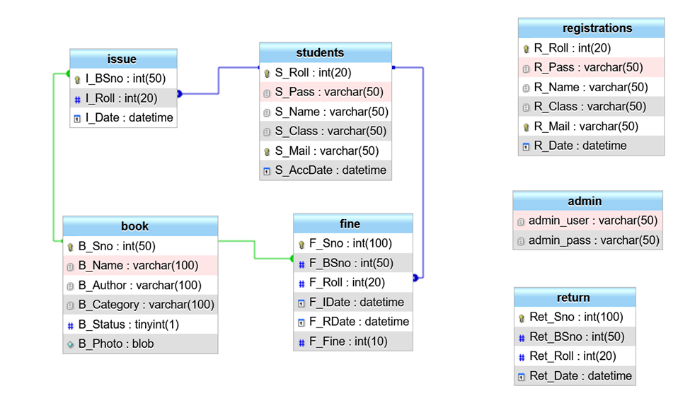

---


## 📖 References

- *Web Application Development using PHP* – Tarsem Singh, Asha Rani  
- *Information System Design and Implementation* – Puneet Wadhwa  
- [W3Schools](https://www.w3schools.com/)  
- [MDN Web Docs](https://developer.mozilla.org/)  
- [StackOverflow](https://stackoverflow.com/)  

---

## 👨‍💻 Author

**Aman Kumar**  
 
